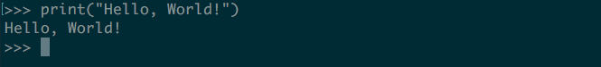

Welcome to "Hello, World!"
::::::::::::::::::::::::::

LaunchCode began offering "Hello, World!" in November 2015, in response to overwhelming demand from individuals curious about computer programming. While there are dozens of free introductory courses online, few provide the context needed to decide whether or not you should pursue a career in the field, or how to go about doing so. And few such courses combine big-picture ideas in computer science with the nitty gritty of how code actually works. In this course, we attempt to do all of this.

This course will certainly not teach you all of the skills you need to get a job as a programmer. It will, however, serve as a gateway into the world of programming, giving you the a taste of the field and the confidence and resources necessary to continue your journey.

By the end of this short course, you will:

- Understand several universal programming concepts utilized by professional programmers every day.
- Be comfortable writing basic Python programs.
- Understand how your knowledge of Python translates to other programming languages.
- Have a clear picture of how to continue expanding your programming knowledge.
- Understand how LaunchCode can help you along your pathway to a new career as a programmer.

On this last point, let's learn a bit more about LaunchCode.
