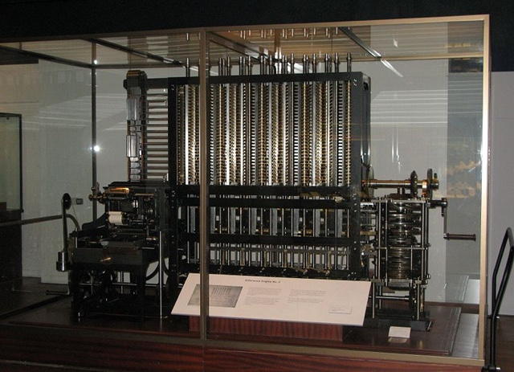

What Are Computers?
::::::::::::::::::::::::::

We use computers every day, and depending on your job, you may spend most of your day on a computer. We even carry around small computers in our pockets! But we typically take computers and the way that they work for granted. What exactly is going on inside those smartphones, laptops, and desktops? How does an iPhone know what to do when I move my finger from right to left across the screen? How is a search engine able to guess what I'm typing so quickly?

We can't answer these questions in detail right now, but we can provide a perspective on what computers are capable of, and how they do some of the complex things that they do.

      Charles Babbage's Difference Engine, considered by some to be the first computer. *Image source: `wikipedia.org`_*

From `simple.wikipedia.org`_:

    A computer is a machine (mostly electronic) that is able to take information (input), do some work on or make changes to the information (process), to make new information (output). Computers have existed for much of human history. Examples of early computers are the astrolabe and the abacus. There are four main processing steps in a computer, and they are: inputting, outputting, storage and processing.

    Modern computers are very different from early computers. They can do billions of calculations per second. Most people have used a personal computer in their home or at work. Computers do many different jobs where automation is useful. Some examples are controlling traffic lights, vehicle computers, security systems, washing machines and digital televisions.

    A computer user can control it by a user interface. Input devices include keyboard, mouse, buttons, touch screen. Some very new computers can also be controlled with voice commands or hand gestures or even brain signals through electrodes implanted in the brain or along nerves.

    Computers can be designed to do almost anything with information. Computers are used to control large and small machines which in the past were controlled by humans. They are also in homes, where they are used for things such as listening to music, reading the news, and writing.

    Modern computers are electronic machines. A computer is only useful if it has both hardware and software. Hardware is the physical parts the computer is made of - for example keyboard, mouse, screen, tower, and the circuits inside it. Software is the computer programs (mathematical instructions). The software uses the hardware, when the user gives it instructions, and gives useful output.

    Many modern computers do billions of calculations each second. They do mathematical arithmetic very quickly but computers do not really "think". **They only follow the instructions in their software programs.**

    Computer programs are designed or written by computer programmers. A few programmers write programs in the computer's own language called machine code. Most programs are written using a programming language like C++, Java, and Python. These programming languages are more like the language you talk and write with every day. A program called a compiler translates the user's instructions into binary code (machine code) that the computer will understand and do what is needed.

*Referenced on September 4, 2016. Emphasis added.*

**Computers are simple computational machines**

When you think of a computer, rather than the image of device that seems all-powerful and capable of things that you can barely imagine, think of a mechanical machine. Think of something incredibly simple in concept, capable of carrying out a few basic operations, but capable of doing so extremely fast, and without tiring. In concept, there is nothing a computer can do that a human could not. The difference in what humans and computers are capable of lies in speed and repetition.

**Computers do not understand context or nuance**

As simple machines, computers are not intelligent to understand context or nuance. They are only capable of reading the input they are given, processing it in the described way, and delivering the resulting output. If we, as the humans providing the input and the instructions, are not precise and explicit enough, the computer will not be capable of adjusting for our lack of care.

Computers understand **syntax**, but not **semantics**. Syntax is the formal structure of a statement, while semantics consists of meaning of a statement. To differentiate between these concepts, let's look at a couple of examples.

**Example 1:**

*"The thief was sentenced to 3 years in the violin case."*

The most common first interpretation of this sentence is of a thief charged with some crime involving a violin being sentenced to 3 years in prison. However, an equally valid meaning of this sentence is that, as a consequence of being found guilty of a crime, the thief was sentenced to spend 3 years inside a violin case.

**Example 2:**

*"Colorless green ideas sleep furiously."*

While the previous example was a sentence that had two semantic interpretations, or meanings, this example shows that a statement can be syntactically correct, yet not have any tangible meaning. What does it mean to be both green and colorless? How can an idea sleep? And what does it mean for anything to "sleep furiously"? These combinations of words are nonsense from a semantic perspective, yet they still make up a well-formed (i.e. grammatically correct) sentence.

When we code, we must keep in mind both the syntax and the semantics of what we are writing. Code that lacks in syntax will not be understandable by the computer, while code that lacks semantics will have consequences other than what we intended.

.. _`simple.wikipedia.org`: https://simple.wikipedia.org/wiki/Computer
.. _`wikipedia.org`: https://en.wikipedia.org/wiki/Difference_engine
