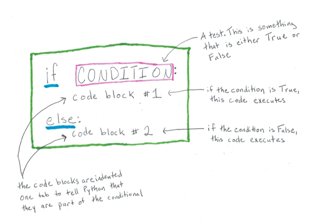
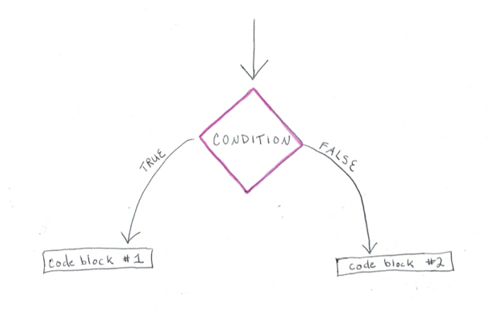

Conditional syntax
::::::::::::::::::

We introduced the concept of a conditional as a way to "make a decision" with our code. Another way to think about this is that conditionals allow our programs to change their behavior based on the conditions that exist when a program runs.

The formal way that this happens is via a condition, which is a Boolean expression. You learned about boolean expressions in the last section. Let's combine that concept with a detailed look at conditional syntax to fully understand how to use conditionals in our programs.

This digram illustrates the syntax for the most common way to write conditionals.

.. note::

   - ``CONDITION`` is a Boolean expression, that is, something that will be either ``True`` or ``False``
   - The ``if`` statement consists of a header line and a body. The header line begins with the keyword ``if`` followed by a *boolean expression* and ends with a colon (:). Similarly, the `else` line ends with a colon, but does *not* have a condition.
   - The indented statements that follow the if/else lines are called **blocks**. The first unindented statement marks the end of the block. Multiple lines of code are allowed in a block, so long as they are properly indented.
   - Only *one of* block 1 or 2 will be executed, depending on the ``CONDITION``. If the condition is ``True``, then block 1 executes. If it is ``False``, then block 2 executes.
   - There are ways to build more complicated conditionals, with more than one test/condition. We won't look at those in this course.

We sometimes call each of the ``if`` and ``else`` portions of code a **branch**. This is because the control flow for the program resembles a branch, or a "fork in the road." Here's a conceptual way to think about this.

Let's look at an explicit example.

.. activecode:: ch03_contional_ex1

    x = 15

    if x % 2 == 0:
        print(x, "is even")
    else:
        print(x, "is odd")

.. admonition:: Practice

    Modify the example above to prompt the user for a number, rather than use a variable with a pre-defined value. Remember that using the `input` function will always give us a string, so you'll need to convert the string to an integer to check if it's even or odd.

.. note::

    A conditional does not require an `else` block. It is perfectly valid to write conditionals that look like the following.

    .. sourcecode:: python

        if CONDITION:
            # code block

**Check your understanding**

.. mchoice:: test_question3_1
   :answer_a: Just one.
   :answer_b: Zero or more.
   :answer_c: One or more.
   :answer_d: One or more, and each must contain the same number.
   :correct: c
   :feedback_a: Each block may also contain more than one.
   :feedback_b: Each block must contain at least one statement.
   :feedback_c: Yes, a block must contain at least one statement and can have many statements.
   :feedback_d: The blocks may contain different numbers of statements.

   How many statements can appear in each block (the if and the else) in a conditional statement?

.. mchoice:: test_question3_2
   :answer_a: TRUE
   :answer_b: FALSE
   :answer_c: TRUE on one line and FALSE on the next
   :answer_d: Nothing will be printed
   :correct: b
   :feedback_a: TRUE is printed by the if-block, which only executes if the conditional (in this case, 4+5 == 10) is true. In this case 5+4 is not equal to 10.
   :feedback_b: Since 4+5==10 evaluates to False, Python will skip over the if block and execute the statement in the else block.
   :feedback_c: Python would never print both TRUE and FALSE because it will only execute one of the if-block or the else-block, but not both.
   :feedback_d: Python will always execute either the if-block (if the condition is true) or the else-block (if the condition is false). It would never skip over both blocks.

   What does the following code print (choose from output a, b, c or nothing).

   .. code-block:: python

     if 4 + 5 == 10:
         print("TRUE")
     else:
         print("FALSE")

.. mchoice:: test_question3_3
   :answer_a: Output a
   :answer_b: Output b
   :answer_c: Output c
   :answer_d: Output d
   :correct: c
   :feedback_a: Although TRUE is printed after the if-else statement completes, both blocks within the if-else statement print something too. In this case, Python would have had to have skipped both blocks in the if-else statement, which it never would do.
   :feedback_b: Because there is a TRUE printed after the if-else statement ends, Python will always print TRUE as the last statement.
   :feedback_c: Python will print FALSE from within the else-block (because 5+4 does not equal 10), and then print TRUE after the if-else statement completes.
   :feedback_d: To print these three lines, Python would have to execute both blocks in the if-else statement, which it can never do.

   What does the following code print?

   .. code-block:: python

     if 4 + 5 == 10:
         print("TRUE")
     else:
         print("FALSE")
     print("TRUE")

   ::

      a. TRUE

      b.
         TRUE
         FALSE

      c.
         FALSE
         TRUE
      d.
         TRUE
         FALSE
         TRUE
